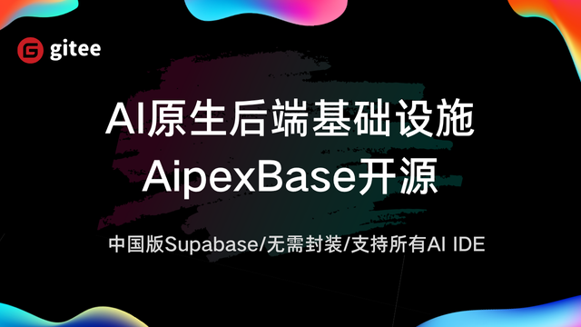

# AIPEXBASE

<p align="center">
  <strong>AI 时代的后端即服务基础设施</strong>
</p>
<p align="center">
  <a href="https://opensource.org/license/apache-2-0">
    
  </a>
  <a href="https://github.com/kuafuai/aipexbase">
    
  </a>
  <a href="https://spring.io/projects/spring-boot">
    
  </a>
  <a href="https://vuejs.org/">
    
  </a>
</p>
<p align="center">
  <em>让开发者在构建 AI 应用时无需关注后端接口开发</em>
</p>


<p align="center">
已支持： <a href="https://www.codeflying.net/"><strong>码上飞</strong></a> | Cursor | Trae 等产品接入 · 共同推动 AI CODING 新纪元
</p> 

<p align="center">

</p>

## 🚀 核心理念

**不写后端，也能拥有完整后端**

aipexbase 通过标准化的 AI 原生后端能力，让开发者**无需再关心后端本身**。无论你使用哪种 AI Coding 工具（如 Cursor、Trae 等），都可以轻松接入 aipexbase SDK，在 AI 的辅助下直接完成从前端到云端的一体化开发。

## 🎥 功能演示
([功能演示视频，一分钟带你开发一个有前后端的WEB应用](https://www.bilibili.com/video/BV1icW9zRERh/))

## ✨ 特性

### 🧠 AI 原生架构
- **原生兼容 MCP (Model Context Protocol)**：模型与智能体可直接调用后端能力
- **统一上下文与数据层**：让 AI 应用具备长期记忆与可追踪状态管理
- **前端即后端**：前端开发者无需关心 API、Server、DB 实现，专注业务逻辑

### 🛠️ 开箱即用的后端能力
- **数据存储**：自动化的数据库操作与管理
- **用户鉴权**：完整的身份认证与权限控制
- **三方接入**：无缝集成主流 AI 服务和平台
- **上下文管理**：智能的会话和状态维护

### 🇨🇳 国产生态全面适配
- **原生支持**：飞书、钉钉、微信等国内主流平台
- **多端兼容**：鸿蒙应用、小程序、WebView 容器
- **国产友好**：深度适配中国开发生态


## 🚀 5 分钟快速上手
#### 第一步：安装

**方式一：源码安装**

1、配置要求
- Java 1.8+
- Node.js 18+
- MySQL 8.0+ 

2、克隆代码
```bash
git clone https://github.com/kuafuai/aipexbase.git
cd aipexbase
```

3、将 sql 脚本导入本地 mysql 数据库 [SQL](./install/mysql/init.sql)


4、修改数据库连接配置
```bash
cd backend/src/main/resources
修改 application-mysql.yml 文件默认的 jdbc 配置
```

5、本地启动后端服务
```bash
mvn spring-boot:run

服务启动在 http://localhost:8080
```

6、本地启动管理后台（可选）
```bash
cd frontend
npm install
npm run dev
```


**方式二： Docker Compose 快速部署（推荐）**

[查看安装指南](./docs/INSTALL.md)

#### 第二步：集成 AI IDE（如 Trae、Cursor 等）极速构建您的应用

[查看集成指南](./docs/IntegrationAI.md)

## 📅 Roadmap

[查看RoadMap](./docs/ROADMAP.md)

## 使用手册
[AipexBase 使用手册](https://vvx03gck2p.feishu.cn/docx/LSsLdYZQfoAo3zxTkwrcJuGVnC3)


## 🌟 愿景
让每一个开发者、每一个 AI Agent，都能轻松构建具备完整后端能力的智能应用。

aipexbase 致力于成为 AI 应用开发的基础设施与行业标准，推动 AI 原生开发的普及和发展。

## 联系我们
📮邮箱：service@kuafuai.net
 
## 英文版
[English Docs](./docs/README_en.md)
 
